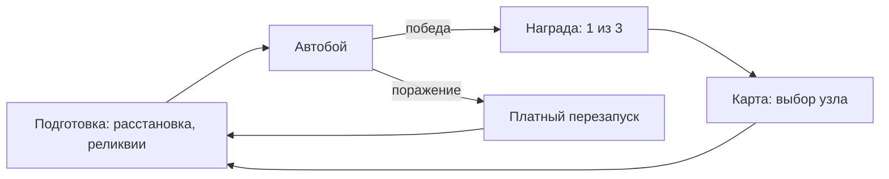

# Сильные артефакты ГДД

Читать при создании vision/столпов/диаграмм и новых карточек. Это часть роста Макса как
ГД — не просто «записать», а записать так, чтобы док думал за команду.

## Vision one-pager (`10-vision/vision`)

Одна страница, которую не жаль выбросить и переписать. Отвечает на: чем игра ЯВЛЯЕТСЯ и
почему в неё интересно. Блоки:

- **Elevator pitch** — 1–2 предложения.
- **Дизайн-столпы** — ссылка на `pillars`.
- **Core loop** — Mermaid-диаграмма (см. ниже).
- **Ключевая механика** — что делает игру уникальной.
- **Look & feel, платформа** — коротко.

Пишет Макс (я оформляю и задаю вопросы). Это самый дешёвый и самый мощный артефакт
пре-продакшна.

## Дизайн-столпы (`10-vision/pillars`)

3–8 фундаментальных концепций, на которых стоит игра. Каждый столп — короткое имя + абзац
«что это значит на практике» + «что этому противоречит».

**Зачем:** столп — фильтр фич. Появилась идея → «служит ли она столпу?». Нет → лёгкий отказ.
Это прокачивает дизайн-мышление сильнее всего: заставляет формулировать суть, а не копить фичи.

Кандидаты-столпы для Guildmaster (черновик, утверждает Макс): «читаемый автобой без микро»,
«решения до боя, не во время», «честность: поражение — моя ошибка, не кража победы»,
«глубина из скейлинга и дефицита». Связать со столпами главы через `pillars:` во frontmatter.

## Mermaid-диаграммы петель

Obsidian и Quartz рисуют Mermaid прямо в странице. Core loop / экономику забега — флоучартом,
не стеной текста: диаграмма ловит дыры (тупики, петли без выхода, ресурс без стока) раньше.

Держи диаграмму рядом с текстом, который она иллюстрирует; при смене дизайна — обновляй её
первой (визуал расходится с текстом заметнее всего).

## Templater-шаблоны карточек

Единый шаблон frontmatter+структуры для новых карточек (реликвии/враги/фракции/главы), чтобы
единообразие было с первого символа, а не приводилось потом. Шаблоны-эталоны уже есть:
`relics/0.2. Шаблон карточки реликвии`, `enemies/0.1. Шаблон карточки противника`. Новую
карточку заводить ИЗ шаблона, не копипастом соседней (копипаст тянет чужие поля и рассинхрон).

## Как писать сильный ГД-документ (чек)

- **Self-contained:** страница понятна без чтения трёх других. Контекст — вверху, ссылки —
  по месту.
- **1 topic = 1 page:** тема разрослась — дели, а не расширяй мега-главу.
- **Решение → причина:** фиксируй не только «что», но «почему» (как в журнале). Без «почему»
  решение перепринимают заново через месяц.
- **Показывай, не описывай:** диаграмма/таблица/мокап вместо абзаца, где можно.
- **Термины — из глоссария**, значения — ссылкой на канон-дом, не копией.
- **Статус честный:** `draft` пока набросок; не помечай `ready` то, что не готово к реализации.
