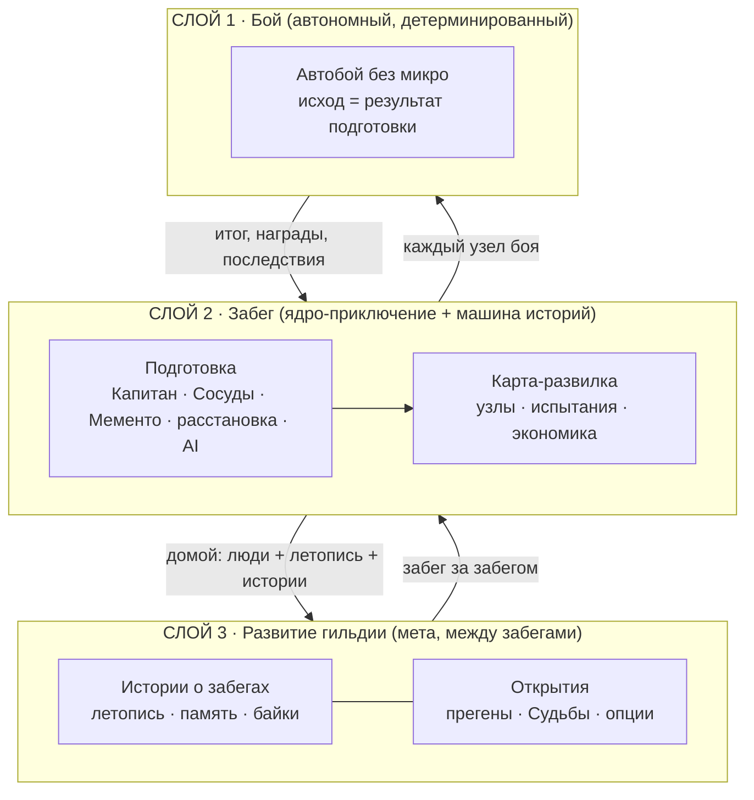

> [!warning] Черновик на сверку — пересматривает концепцию (2026-07-19)
> Это **сводный питч/канон-срез** текущей концепции. Собран после сдвига ролевой рамки
> (игроки = **Гильдмастеры**, кооп = комитет мастеров; боевой набор-сущность → **Капитан**),
> появления слоя **развития гильдии** и **разворота тона** (светлое → мрачное, обман ожиданий). Пока это `draft` на
> правку Максом, а **не** утверждённый канон. Пометки `[proposed]` — мои формулировки,
> ждущие подтверждения. После утверждения — разнести в журнал [[journal-adr]] и в главы (§12).

# Guildmaster — сводный питч

> **Рабочее название игры (2026-07-19): _Happy Guildmasters_** — милота-с-двойным-дном
> (фанни → мрак) + называет роль игрока. В Steam / домене / соцсетях чисто; «Guildmaster» —
> снова игровой термин (роль игрока, см. §3). Осталась формальная TM-проверка (TESS +
> поверенный) и захват домена/хендлов перед вложениями в бренд. Отвергнуто: *Happy Little
> Guildmasters* (конструкция «HAPPY LITTLE» — товарный знак Bob Ross Inc., активно защищается).

---

## 1. Elevator pitch

**Кооперативный автобаттлер-рогалик про руководство гильдией.** Вы (1–4 игрока) —
**совместные Гильдмастеры одной гильдии** (кооп = комитет мастеров), которые ведут её —
растущую **в поисках славы** — через разные **кампании** (турнир, война, покорение вершины —
цель варьируется). Сами в бой вы не вмешиваетесь — вы его **готовите**:
берёте в забег **Капитана**, набираете **«Сосудов»** (обычных людей без своих статов),
раздаёте им **Мементо павших героев** (вся сила бойца — из Мементо: «пилот + чемпион»),
расставляете отряд и программируете его поведение. **Бой идёт сам — детерминированно, без
единого кубика:** поражение объяснимо и присвоено вам, а не удаче. Но из руководства рождается
не только победа — **забег сам генерит истории**: через Сосудов, их реплики и дружеский хаос
вашей кооперации, как в *Dwarf Fortress*. Игра встречает как **добрая забавная кооп-игрушка**
с лёгким юмором — и чем дальше, тем неожиданно глубже и **темнее**.

---

## 2. Жанр и формат

- **Кооп (1–4) автобаттлер-рогалик**, host-authoritative.
- **Бой автономен, без микро** — ввода игрока во время боя нет. Обслуживает столп «Честность».
- **Детерминированная симуляция** (фикс-тик 30 Гц, без Unity-физики, непрерывное 2D-поле).
- Платформа: **PC (Windows), Steam**; кооп через Steam.
- Визуал: **плоский «сторибук», топ-даун** — с сильным акцентом на **подачу и
  ощущение** (см. §4 столп «Ощущение» и §11).

---

## 3. Ролевая рамка (обновлено 2026-07-19)

| Роль | EN (рабоч.) | Что делает |
|---|---|---|
| **Гильдмастер** (игрок) | Guildmaster | 1–4 игрока — **со-мастера одной гильдии** (кооп = комитет мастеров). Выбор Капитана, набор Сосудов, драфт Мементо, расстановка, AI-профили, экономика, маршрут. В бою лично не участвуют |
| **Капитан** | Captain | Тот, кого гильдия **берёт в забег** (эту боевую сущность ранее звали «Гильдмастер»). Задаёт стартовый набор Мементо, гильдие-широкие бонусы и стиль. **Влияет на бой пассивно — через подготовку, не на поле и без ввода в бою** |
| **«Сосуд»** | Vessel | Обычный человек **без своих статов**. Носитель Мементо — и **линза нарратива** (§9): его досье, реплики и летопись рассказывают историю забега |
| **Мементо героя** | Hero Memento | Памятная вещь павшего героя с его силой. Несёт **весь боевой кит**. 1 на 1 Сосуда, переназначается перед боем |

> При утверждении — в [[glossary]]: завести **«Капитан / Captain»** (боевой набор-сущность);
> **«Гильдмастер / Guildmaster»** переопределить как **роль игрока** (руководитель гильдии),
> а не боевую сущность. В коопе Гильдмастеров несколько на одну гильдию — фича кооп-хаоса.

---

## 4. Дизайн-столпы

Фундамент — фильтр фич («служит столпу? нет → режем»). Полностью — [[pillars]]. Столпы 3 и 5
переформулирован/добавлен 2026-07-19 (приняты Максом).

1. **Честность прежде всего** — поражение = своя ошибка, не кража победы. Весь рандом *до*
   решения, ноль *после*. Перезапуск = тот же бой (отладка, не переролл).
2. **Глубина из скейлинга, дефицита и синергий** — не из APM.
3. **Нарратив рождается сам** — игра **генерит истории системно**: через Сосудов
   (досье, реплики, летопись), последствия забега и **кооп-хаос**. Привязанность к конкретным
   героям — часть этого, но акцент шире: забег как **машина историй** (*Dwarf Fortress*,
   *RimWorld*). *(Прежняя формулировка столпа — «Сосуды — живые личности».)*
4. **Гильдия — дом, забег — приключение** — чёткая граница дома и вылазки.
5. **Ощущение важнее верности формату** — **джус как приоритет дизайна**: SFX,
   VFX, gamefeel, свет. Картинка обязана ощущаться технически богатой, сочной и визуально
   интересной. *(Прежняя формулировка столпа — «Ощущение важнее верности пикселю».)*

---

## 5. Слои игры

**Нарратив — сквозная система**, а не отдельный слой: рождается в забеге (§8) через Сосудов и
хаос, копится в гильдии (§9) как истории.

---

## 6. Бой (Слой 1)

- **Полностью автономный.** Все решения — в подготовке (Мементо, позиции, приоритеты целей,
  AI-профили). Пауза (`Space`) — только просмотр, не боевая механика.
- **Ноль выходного рандома:** нет крит-шанса, промаха, уклонения (детерминированные «слепота»/
  «меткость» = каждая X-я атака).
- **Модель урона** ([[stats]], [[effects]]): **школы** (Физическая + Магическая, гасятся бронёй) +
  **Чистый (True)** мимо брони; поверх — **сродства** (яд/свет/тьма) как «вкус». Школа задаётся
  **каждому источнику отдельно**: тычка и ульта одного юнита могут быть разных школ.
- **Эффекты = глаголы, синергия = producer → consumer** ([[effects]]). Лучшие синергии меняют
  **правило**, а не «+%».
- **CC, комбо-теги** (мокрый/наэлектризованный/подожжённый/обмороженный), кросс-элементы
  (раскол/детонация/рикошет), **зоны** — приняты, детали TBD.
- **Типы боёв:** обычный / элитный / финал акта. **Босс = комбинация юнитов**. Поддержаны
  третья сторона и «все против всех».
- **Многофазовые сражения** (элиты/боссы/ивенты) с окном подготовки и текстовыми ивентами —
  приняты, детально не расписаны (TBD).
- **Перезапуск = тот же самый бой** (меняется только твоя подготовка). Платный, пул 2 на акт.

> Анти-затягивание (ускорение ×2, авто-ничья) — **решено, но не реализовано**. Не подавать
> как готовое.

---

## 7. Контент боя: Мементо · Сосуды · Капитан · Предметы

- **Мементо** ([[relics-overview]]) — нейминг `The [X] (Класс)`, несут весь кит.
  Редкость = **размер кита** (Треш / Обычная / Уникальная). Тип (ось): Стандартная 85% /
  Проклятая 10% / Божественная 5%. Улучшения: 6 = T1×3 + T2×3, свободное комбинирование.
  Архетипы: *The Pyre, The Bonewright, The Winter, The Storm, The Hunter, The Martyr*…
- **«Сосуды»:** перк «+»/«−» (1 из 3), фиксируются **при найме навсегда**; **Судьба** — квест
  внутри забега, а не свойство человека (2026-07-27/17). Прегены vs наёмные. Режим
  **«Истинный герой»**.
- **Капитан:** стартовый набор + гильдие-широкие модификаторы + внебоевые правила. Общий выбор
  группы. Пассивное влияние.
- **Предметы:** 3 слота на Сосуда, авто-триггеры. **Знамёна** (Party, 2 активных) — «ковенанты»
  забега, архетип «страдание = сила». Дизайн Знамён — в пересмотре у Макса.

---

## 8. Забег (Слой 2) — ядро и машина историй

- **Карта** в духе *Slay the Spire* — акты с развилками, генерится из сида. Конец акта — бой
  с **гильдией-финалистом**.
- **Узлы:** Бой (обычный/элитный) · Магазин · Тренировка · Лечение · Турнирное событие ·
  Риск-ивент · мини-игры. На узле видно **фракцию + сложность**, точный состав — нет.
- **Испытания** — квест игроку, **не** модификатор боя. Провал = без награды, не поражение.
- **Последствия** — строго в границах забега: **Травма** ↔ **Закалка**. В конце испаряются.
- **Нарратив забега** генерится по ходу: Сосуды комментируют, подвиги пишутся в летопись,
  хаос кооперации и последствия рождают **байки**, которых никто не сценарил.

---

## 9. Развитие гильдии (Слой 3, метапрогрессия) — обновлено 2026-07-19

Отдельный слой поверх забега: **гильдия растёт как дом между забегами.**

> [!done] Слой разобран целиком 2026-07-27 — канон [[guild-development|Run - Guild Development]]
> Дом: ростер 8→64, наём кандидатов и «наём с запросами», **ветераны** (пережил завершённый забег)
> и гейт вершины, **смертность как функция возвышения** (низкие — не гибнут, высокие — гибнут в
> ивентах и особых боях), валюта **дома** против вех для контента, **Книга гильдии**
> (Летопись + Хроника + Мемориал, пишутся все, включая павших), хаб из трёх разделов.

- **Что переносится:** сами **«Сосуды»** (люди), их **Летопись подвигов** (реальное число +
  «кем был тогда») и **истории о забегах** — память гильдии, эмоциональная преемственность.
- **Что НЕ переносится (принцип, решения [[journal-adr]] 25/31):** голая **мощь**, уровни,
  мементо, Последствия. Открытия **расширяют пул вширь**, не поднимают потолок мощи.
- **Прегены** открываются вехами в профиль; играя ими — открываешь **их перки и досье** (новые
  **опции**, не бафф к базе; 2026-07-27/16). Экземпляр прегена у каждого дома свой и смертен.
- **Досье «Сосуда»** — процедурная личность на забег (мечта/характер/история/**тайна**).
  Летопись — персистентна.
- **Явно НЕ делаем:** LLM-генерация, ветвящийся нарратив, диалоги, отношения между Сосудами.

> [!done] ЗАКРЫТО 2026-07-27: развитие = опции + память, форма историй = **Хроника дома**
> Развитие слоя — **опции и удобство** (слоты, баны, кандидаты, косметика) плюс **память**, без
> силовой инфляции; открываемый контент берётся только игрой, за деньги не продаётся. «Истории о
> забегах» — **лента забегов в Книге гильдии**, мемориал павших — её раздел, а не вторая система.

---

## 10. Кооп — свобода и дружеский хаос (обновлено 2026-07-19)

Кооп — про **свободу и дружеский хаос**, а не про жёсткие роли-ограничения.

- Технически **host-authoritative** (1–4 игрока; отряд забега — 4 «Сосуда» на старте, растёт до 8).
  Гильдия **единая**: «Сосуды» между игроками не распределяются, любой Гильдмастер распоряжается
  любым.
- Поверх — **свобода лезть в общее**: брать Мементо из рук, вмешиваться, прикалывать друг друга.
- **Порядок в гильдии — обязанность и выбор самих игроков** (социальный контракт), а не
  ограничение, наложенное игрой. Игра не запрещает хаос — она даёт им **владеть**.
- Где мнения расходятся — игра даёт **инструменты-арбитры**: мини-игры и броски (например,
  **кубик при голосовании**), которые сами становятся источником баек.
- Драма и истории (§8) рождаются именно из этой свободы.

---

## 11. Тон и обман ожиданий (обновлено 2026-07-19)

**Обман ожиданий — центральная тональная задумка.**

- **Вход:** добрая, забавная кооп-игрушка с лёгким юмором — «хихи-фэнтези».
- **Дуга:** чем дальше по кампании, тем история **исподволь набирает мрачные тона**. Не резко —
  медленно. От «хихи, мило» к «хихи, но… ёмаё, ппц».
- Светлый вход — **не обёртка, а честная приманка**: чем убедительнее милота, тем сильнее бьёт
  потемнение. Порядок нерушим: сперва искренняя лёгкая рамка, потом слом.
- **Ключ разворота (принят 2026-07-27):** пролог встречает фразой **«Это история о битве хаоса и
  порядка…»**, она повторяется рефреном — и в финале дуги объясняется наоборот: **хаос — это
  живые** (люди и существа), **порядок — Система**, всё сильнее влияющая на мир. Переворот идёт
  **через переосмысление уже сказанного**, а не через новую информацию, поэтому читается как «оно
  всегда было тут». Это же — якорь реестра посевов (консоль у трёх фракций, безумие боссов).
- Связь: идея «мир, который знает, что он игра» (slow-burn раскрытие конструкта) и «шёпот
  толпы» из [[open-forks]] — теперь **кандидаты в носители** этого разворота, а не сторонняя приправа.

**Кампании (цель варьируется):** над кампаниями — **единый каркас**: гильдия растёт и **ищет
славы**; конкретные кампании — разные великие дела под этим зонтом (Чемпионат, война,
покорение вершины и т.п.). Чемпионат — одна из кампаний, не единственная рамка.

---

## 12. Что эта рамка пересматривает (на разнос после утверждения)

- [[guildmaster]] — боевую сущность переименовать в **Капитан**; **«Гильдмастер» закрепить за
  игроком** (роль руководителя гильдии).
- [[concept]], [[vision]] — elevator/ключевая идея под новую рамку, три слоя, **цель =
  кампании** (не только Чемпионат), **разворот тона**, нарратив-как-система.
- [[pillars]] — обновить столп 3 (нарратив) и добавить столп 5 (ощущение/джус) — **приняты
  2026-07-19**.
- [[glossary]] — завести **Капитан**; переопределить **Гильдмастер** как роль игрока.
- [[meta-progression]] — усилить как Слой 3; согласовать глубину (§9).
- [[open-forks]] — «мир-как-конструкт» и «шёпот толпы» повысить в статусе, если тон-разворот принят.
- [[lore]] — сеттинг под кампании и обман ожиданий.

---

## 13. Store-позиционирование (черновик 2026-07-19)

- **Название (имя):** **Happy Guildmasters** — держим коротким и чистым; жанр несут short
  description и теги (не подзаголовок в имени).
- **Short description** (строка под именем; вариант B — ирония фанни→мрак + назван жанр):
  - EN: *Recruit ordinary people, hand them the relics of dead heroes, and watch it all go
    horribly right. A co-op autobattler roguelike that starts adorable and doesn't stay that way.*
  - RU: *Набери обычных людей, вручи им мементо павших героев и смотри, как всё идёт ужасно
    хорошо. Кооп-автобатлер-рогалик, который начинается мило — и недолго таким остаётся.*
- **Теги** (порядок = вес находимости):
  - **Ядро:** `Auto Battler` · `Roguelike` · `Co-op` · `Strategy` · `Online Co-Op`
  - **Дескрипторы:** `Party-Based` · `Tactical` · `Management` · `Pixel Graphics` · `Fantasy`
    · `Multiplayer` · `Singleplayer`
  - **На потом (когда мрак-слой оформится):** `Story Rich` · `Dark Fantasy` · `Choices Matter`
- Козырь находимости: пересечение `Auto Battler` + `Co-op` — редкое (ниша полупустая).

---

## Открытые узлы (кратко)

- **Глубина мрака / мета:** насколько темно уходит и поднимаем ли «мир-как-конструкт» в ядро —
  вектор зафиксирован, глубину решаем отдельной сессией (§11). **Ключ разворота принят
  2026-07-27** — см. §11.
- ~~**Развитие гильдии:** что растёт и форма «историй о забегах»~~ — **закрыто 2026-07-27**,
  канон [[guild-development|Run - Guild Development]].
- **Название игры** — рабочее: **Happy Guildmasters**. Осталась формальная TM-проверка
  (TESS + поверенный) и захват домена/хендлов перед вложениями в бренд.
- Многофазовые бои, зоны, кросс-элементы, числа баланса — TBD.
