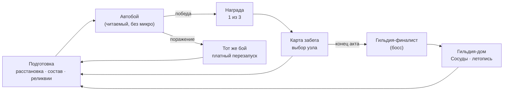

> Одна страница о том, чем игра **является**. Черновик на правку Максом — эту страницу не жаль
> переписать целиком.

## Elevator pitch

**Guildmaster** — кооперативный **автобаттлер-рогалик в реальном времени с паузой**. Ты —
Гильдмастер: набираешь «Сосудов» (обычных людей), даёшь им **Реликвии** павших героев и ведёшь
гильдию через забег. Бой идёт **сам** — автономно и читаемо; всё мастерство в **подготовке**:
расстановка, состав, реликвии, синергии, экономика. Проигрыш — всегда твоя ошибка, не рандом.

## Дизайн-столпы

Четыре столпа — фильтр всех решений. Полностью — [[pillars|Дизайн-столпы]].

1. **Честность прежде всего** — поражение = своя ошибка, не кража победы.
2. **Глубина из скейлинга, дефицита и синергий** — не из APM.
3. **«Сосуды» — живые личности** — привязанность к конкретным героям.
4. **Гильдия — дом, забег — приключение** — чёткая граница дома и вылазки.

## Формат (что это за игра)

- **Бой автономен и читаем, без микро.** Ввода во время боя нет — это медиум игры, а не
  ограничение. Читаемость боя обслуживает столп «Честность».
- **Реал-тайм с паузой**, host-authoritative кооп (до 4).
- Ядро — **забег**; между забегами — **гильдия-дом**.

## Core loop

## Ключевая уникальность

- **«Сосуды» с процедурной личностью** (досье, Травмы/Закалка, Судьбы, летопись) — эмоциональная
  привязка, которой нет у безликих автобаттлеров.
- **Честность как дизайн-приоритет** уровня gamefeel — прямой ответ на боль жанра «нет глубины /
  ощущается нечестно» (см. [[depth|Где живёт глубина]]).
- **Нарратив посреди боя** — текстовые ивенты между фазами многофазовых сражений.

## Look & feel · платформа

- Пиксель-арт, топ-даун бой; тёплый «сказочный» тон.
- PC (Windows), Steam; кооп через Steam.
