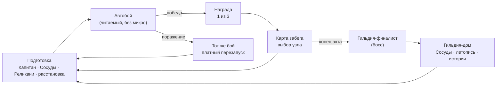

> Одна страница о том, чем игра **является**. Полный сводный срез — [[pitch]].

## Elevator pitch

**Happy Guildmasters** (рабочее имя, принято 2026-07-19/9) —
кооперативный **автобаттлер-рогалик про руководство гильдией**. Вы (1–4 игрока) — совместные
**Гильдмастеры** одной гильдии: берёте в забег **Капитана**, набираете «Сосудов» (обычных
людей без своих статов), даёте им **Реликвии** павших героев и ведёте гильдию через кампании.
Бой идёт **сам** — автономно, детерминированно, без кубика; всё мастерство в **подготовке**.
Проигрыш — твоя ошибка, не рандом. Игра начинается доброй забавной кооп-игрушкой — и чем
дальше, тем неожиданно **темнее**.

## Дизайн-столпы

Пять столпов — фильтр всех решений. Полностью — [[pillars]].

1. **Честность прежде всего** — поражение = своя ошибка, не кража победы.
2. **Глубина из скейлинга, дефицита и синергий** — не из APM.
3. **Нарратив рождается сам** — забег как машина историй (Сосуды, реплики, летопись, кооп-хаос).
4. **Гильдия — дом, забег — приключение** — чёткая граница дома и вылазки.
5. **Ощущение важнее верности пикселю** — джус (SFX/VFX/gamefeel/свет) как приоритет.

## Формат (что это за игра)

- **Бой автономен и читаем, без микро.** Ввода во время боя нет — это медиум игры, а не
  ограничение. Читаемость обслуживает столп «Честность».
- **host-authoritative кооп** (1–4). Игроки — **комитет Гильдмастеров** одной гильдии; порядок
  между ними — их выбор, а не рельсы (свобода и дружеский хаос).
- Три слоя: **Бой** / **Забег** (ядро-приключение) / **Развитие гильдии** (дом между забегами).

## Core loop

## Ключевая уникальность

- **«Сосуды» + системный нарратив** — процедурные личности (досье, Судьбы, летопись) и забег,
  который **сам рождает истории** (кооп-хаос, последствия) — эмоциональная привязка, которой
  нет у безликих автобаттлеров.
- **Честность как дизайн-приоритет** уровня gamefeel — прямой ответ на боль жанра «нет глубины /
  ощущается нечестно».
- **Обман ожиданий** — вход как добрая кооп-игрушка, медленный разворот в мрак. Запоминается,
  со-переживается в коопе.
- **Кооп-хаос как двигатель историй** — свобода лезть в чужое + мини-игры-арбитры (кубик).

## Look & feel · платформа

- **Стилизованный** пиксель-арт, топ-даун бой; сильный акцент на **подачу** (джус, свет).
- Тональная арка: **добрый вход → мрачнеющая история** (обман ожиданий).
- PC (Windows), Steam; кооп через Steam.
