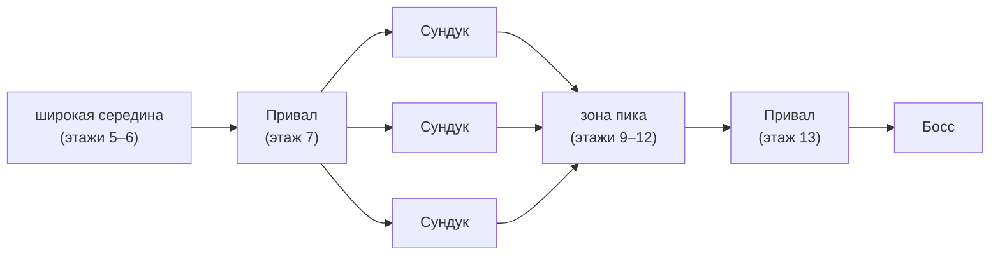

## Карта

Структура карты — как в *Slay the Spire*: акты, ветвления, выбор следующего шага. Каждый акт завершается боем с **гильдией-финалистом**.

### Что игрок видит на узле ДО того, как туда пойти

Ключевой принцип: **рандом до решения — это контент; рандом после решения — это подстава.** Игрок выбирает путь по карте осознанно, поэтому боевой узел раскрывает свои условия заранее.

Видно **сразу, на самом узле** (канон, решение 2026-07-15/66):
- **сложность боя**: обычный / элитный / босс (финал акта — бой с гильдией-финалистом).

Видно **при наведении** (тултип):
- **Вид противников** (например, Гоблины или Разбойники) — задаёт ожидаемый профиль угрозы.
  Сложность — мгновенный ориентир маршрута, Вид — по запросу.

Чего игрок **не** видит заранее (канон): **точный состав врагов** — сколько кого, какие именно бойцы, как расставлены. Только сложность на узле и Вид в тултипе, не более. Иначе подготовка вырождается в подбор жёсткого контрпика под известный список, и в фазе подготовки исчезает драма.

**Открытый вопрос:** видно ли **испытание боя** заранее (при наведении на узел) или оно выдаётся на входе в бой — см. [[gdd/00-meta/open|Meta - Open Questions]]. От этого зависит, где роллится испытание и насколько выбор пути по карте является настоящим решением.

Смысл превью: выбор пути должен быть решением («иду в элитный бой к гоблинам или в обход к разбойникам»), а не броском вслепую.

---

## Типы событий

| Событие | Описание |
|---|---|
| **Бой** | Обычный или элитный — см. [[combat-system]] |
| **Магазин** | Покупка Реликвий и предметов |
| **Тренировка** | Улучшение навыков / подготовка «Сосудов» |
| **Лечение** | Снятие травм, восстановление |
| **Турнирное событие** | Событие, связанное с Чемпионатом |
| **Риск-ивент** | Событие с потенциальной наградой и риском |
| **Привал** | Отряд тратит бюджет действий на несколько трат подряд — см. §«Привал» ниже |

---

## Привал / Camp

Узел-передышка между испытаниями. От текстового события отличается **структурно**: там выбор один и
он же выход, здесь узел — маленькая экономика, а уход — отдельное решение.

**Бюджет (решено 2026-07-20).** Отряд привозит на привал **8 действий**; каждая трата стоит **2** —
то есть ровно **четыре** траты за привал. Пока действий хватает, выбирать можно повторно, в любом
порядке и с повторами.

**Что можно потратить действия на:**

| Трата | Что делает |
|---|---|
| **Усилиться** | TBD — эффект появится вместе с системой усилений |
| **Получить копию реликвии** | TBD |
| **Снять негативное последствие** | TBD — завязано на [[injuries-mettle]] |
| **Нанять сосуда (или заменить старого)** | TBD — завязано на ростер гильдии |
| **Пройти мимо** | Уйти с привала. **Бесплатно и доступно всегда**, даже с пустым бюджетом |

> Статус: список трат зафиксирован, **эффекты — нет**. Узел уже стоит на карте и тратит бюджет,
> механики навешиваются по мере готовности систем, на которые они опираются.

Когда действий на трату не хватает, её кнопка гаснет подписью, но остаётся отзывчивой — общее
правило интерфейса, см. [[ui-feedback]].

### Место привалов в акте

Талия акта (решено 2026-07-20, форма уточнена 2026-07-26): широкая середина сходится в **один
привал**, и уже из него веер в **три сундука** — карта на секунду перестаёт быть выбором и становится
общей точкой, после чего даёт осмысленную развилку из трёх.

**Порядок именно такой — привал, потом сундуки.** Привал самодостаточен как общая точка: это узел
трат и решений, и сводить к нему всю ширину карты осмысленно. Развилка же должна быть выбором, а
три одинаковых привала выбором не являются — три сундука дают разную добычу, то есть настоящую
развилку.

**Перед боссом — всегда привал.** Последняя возможность потратить действия перед финалом акта.
**Магазин обязательным узлом акта не назначается**: он выпадает по весам зоны, гарантирован только
привал.

> [!important] Канон-дом талии акта — этот раздел
> Тех-план ([[tech/40-planning/act-map-run-loop|Planning - Act Map & Run Loop]]) держит третий
> экземпляр той же схемы. Он — **архив замысла реализации**; при расхождении главнее этот док.

---

## Мини-игры

Между основными событиями встречаются редкие **мини-игры** — как для отдельных игроков, так и для соревнования между ними.

**Принципы:**
- встречаются **нечасто**, но должны быть **запоминающимися**;
- добавляют разнообразие основному геймплею;
- возможно встроены в **ивенты на карте**.

### Примеры контекстов

| Контекст | Описание |
|---|---|
| **Создание «Сосуда»** | Мини-игра для выбора перков (участие добровольное) — см. [[relics-overview]] |
| **Ивенты на карте** | Редкие мини-игры как альтернатива или дополнение к обычным событиям |
