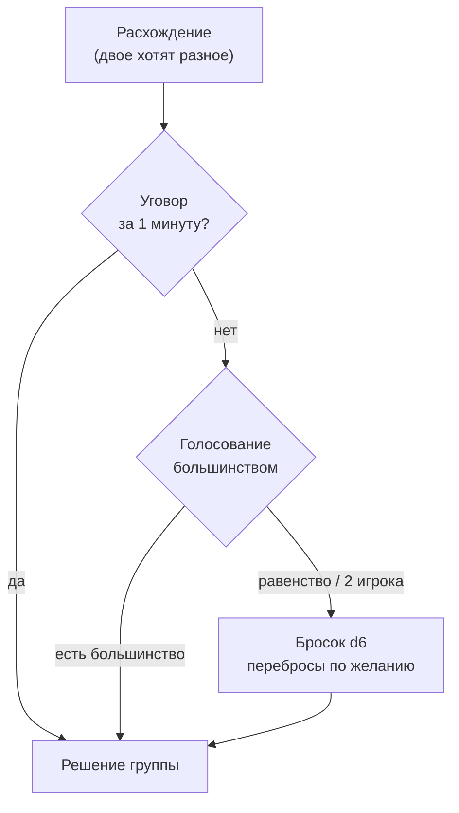

> **Как группа принимает решение, когда мнения расходятся.** Владелец фактов о голосовании, кубике
> и перебросах — этот док (владение забрано у [[events-minigames|Run - Events & Minigames]]
> 2026-07-30: инструмент-арбитр — кооп-механика, а не узел карты).
>
> Принцип-родитель: спор — **не проблема, а контент** (журнал 2026-07-19 №8).

## Где вообще возникает спор

Спорные точки нашей игры перечислимы, и это хорошо: арбитр нужен ровно там, где решение обязано
быть **одним**.

| Точка | Решение одно? | Кто владелец правил |
|---|---|---|
| Маршрут на карте акта | да, идём одной дорогой | [[events-minigames]] |
| Покупка в магазине за общую казну | да, деньги одни | [[guild-development]] |
| Кому достался предмет / реликвия | да, предмет один | [[relics-overview]] |
| Улучшение «Сосуда» при повышении уровня | да (2026-07-27, голосование + кубик при споре) | [[vessel-progression]] |
| Выбор в текстовом событии, диалог с боссом | да | [[events-minigames]] · [[gdd/enemies/bosses/index\|боссы]] |
| Расстановка на арене | **нет**, слотов много | расстановка делится, спор редок |
| Кого нанять / кого отпустить | да | [[guild-development]] |

> **Урок из жанра, важный для нас.** В *Divinity: Original Sin* спор игроков решался мини-игрой
> «камень-ножницы-бумага», а в **DOS2 её убрали** — Larian дала персонажам расходиться в решениях
> вместо того, чтобы сводить их случайностью. Вывод не «арбитры плохи», а точный: **арбитр
> оправдан только там, где решение физически одно**. Где можно позволить дивергенцию — надо
> позволять, а не бросать кубик. У нас гильдия одна и кошелёк один, поэтому дивергенции почти
> негде взяться — арбитр законен.

---

## Заявка Макса: броски d6 при спорах (2026-07-29, `proposed`)

Дословно: **спор между игроками решается броском d6**; за достижения открываются **скины кубиков**.
На забег выдаётся **3 кубика для переброса** (в первом акте — 1), и перебросить можно **союзнику**.

*Почему это хорошая идея именно для кооп-игры без боевого ввода:* спор — единственное место, где
игроки взаимодействуют друг с другом, а не с игрой. Кубик превращает переговорный тупик в **событие
за столом**: НРИ-ритуал вместо голосования. Скины за достижения дают этому ритуалу коллекционный
слой почти бесплатно.

*Оговорка (скрайб):* кубик решает **спор**, а не исход боя — рандом остаётся в социальном слое, где
правило «нулевой выходной рандом» не действует (оно про бой). Перебросы — как раз страховка от
«кубик решил за нас»; передача переброса союзнику превращает их в **общий ресурс доверия**, и это
сильнее, чем личные перебросы.

### Вердикт Макса (2026-07-30): спор — это ВЫБОР игроков, а не обязанность

**Кубик доступен всегда, как только спор заявлен.** Скрайб предлагал лестницу «уговор →
голосование → кубик при равенстве» и то, чтобы кубик **всплывал сам**, когда система видит
расхождение. Отклонено, и формулировка Макса точнее: *«если хотят спорить — почему бы и нет? Это
выбор игроков, а не обязанность»*.

Разница практическая, а не словесная:

- игра **не диагностирует** спор и не подсовывает арбитра — кубик берут сами, когда хотят;
- значит **обязательной лестницы нет**: группа, которая договаривается словами, кубика вообще не
  увидит, и это нормальный способ играть;
- голосование остаётся там, где оно уже канон (улучшение «Сосуда», 2026-07-27) — как **форма
  решения**, а не как обязательная ступень перед кубиком.

**Ничья на d6:** перебрасывают только участники ничьей, и это бесплатно (`proposed` скрайба).
Отказ бросать = согласие с остальными: раз спор добровольный, отказ от него не должен блокировать
группу (`proposed`).

### Пул арбитров: ритуал выбирают спорщики (2026-07-30)

Кроме d6 есть **другие быстрые ритуалы** — «камень-ножницы-бумага» и родня. **Выбирают их сами
спорщики**, а не игра случайным броском (вердикт Макса).

Логика та же, что и у решения выше: раз спор — выбор игроков, то и орудие спора их выбор. «На кубиках
или на камень-ножницах?» — это уже часть перепалки, и отдавать её генератору случайных чисел значит
отбирать у игроков ровно то, что мы им только что дали.

**Дефолт — d6.** Он предлагается сразу, без выбора из меню; остальные ритуалы берут те, кто хочет
разнообразия. Так выбор ритуала не становится ещё одним предметом спора: не сошлись во мнениях
насчёт ритуала — кидаете кубик, он и был по умолчанию.

**Что осталось решить:** список ритуалов (`proposed`: d6 · камень-ножницы-бумага · «кто ближе к
числу» · «на счёт три пальцы») и какие из них требуют **обоих** участников одновременно —
камень-ножницы требует, кубик нет, и это влияет на то, работают ли они при споре втроём.

> Оговорка скрайба, которая при этом остаётся в силе: арбитр — только для решений, которые
> **физически одни** (см. урок DOS1 → DOS2 выше). Ритуал, вызванный по желанию, не должен уметь
> решать за игрока то, что игрок может сделать сам и по-своему.

> Оговорка скрайба, которая при этом остаётся в силе: арбитр — только для решений, которые
> **физически одни** (см. урок DOS1 → DOS2 выше). Ритуал, вызванный по желанию, не должен уметь
> решать за игрока то, что игрок может сделать сам и по-своему.

---

## Порядок принятия решения (`proposed`, скрайб)

Предложение — не «кубик всегда», а лестница из трёх ступеней. Кубик стоит на последней, и это
делает его событием, а не рутиной.

- **Уговор** — по умолчанию и без интерфейса: игроки просто разговаривают.
- **Голосование** — уже канон для улучшений «Сосуда» (2026-07-27, [[vessel-progression]]).
  Распространяется на маршрут, крупные траты, выбор в событии.
- **Кубик** — только тупик: равенство голосов или игра на двоих, где большинства не бывает
  структурно. Именно поэтому d6 в игре на двоих будет главным арбитром, а на четырёх — редким.

---

## Альтернативы кубику (`proposed`, скрайб — на выбор Макса)

Кубик не единственный работающий арбитр, и у каждой альтернативы своя эмоция.

| Арбитр | Как работает | Что даёт | Чем плох |
|---|---|---|---|
| **d6** (заявка Макса) | бросок, скины, перебросы | НРИ-ритуал, байки, коллекция | чистая случайность; в игре на двоих срабатывает часто |
| **«Старший»** | у забега/акта есть игрок с правом последнего слова; роль ротируется | ноль рандома, зато **социальная** драма: право решать надо тратить осмотрительно | требует доверия; обидчивее кубика («это ты решил») |
| **Аукцион** | предмет уходит тому, кто отдал больше личных жетонов/перебросов | спор решается ценой, а не удачей: кто больше хотел, тот и получил | заводит вторую валюту, ближе к PvP-логике |
| **Тяга карты** (реф. *Across the Obelisk*: «кто ближе к 2») | случайный игрок тянет за всех | тот же рандом, но с ощущением «за всех тянет один» | у нас уже есть кубик — второй генератор случайности лишний |

**Вердикт скрайба:** кубик как основной арбитр — да, он лучше всех работает на столп «нарратив
рождается сам». Но **ротация «Старшего» сильнее для крупных решений** (маршрут, финальная трата
перед боссом), потому что там случайность обесценивает подготовку. Разумный расклад: кубик — мелкие
и средние споры, «Старший» — решения, которые видно на исходе забега. Развилка 2 в
[[gdd/50-modes-ux/coop/index|Coop - Overview]].

---

## Скины кубиков (2026-07-29, `proposed`)

Кубик — личная вещь Гильдмастера, которую он приносит за общий стол; чужой красивый кубик видят все.
Это ровно та мелочь, которая делает ритуал ритуалом.

**Два канала после 2026-07-30.** Изначально скины шли только за достижения (канал «контент», в
профиль игрока). С появлением личной валюты ([[wagers|Coop - Wagers & Personal Currency]]) скрайб
предлагает развести: **обычные скины — за валюту, памятные — за достижения**, и вторые не продаются
никогда. Так у обоих каналов остаётся своя ценность, а у игрока — понятная разница между «купил» и
«заслужил». Развилка открыта.

**Ограничение:** скин влияет только на вид. Ни граней, ни весов, ни «удачливых» кубиков — иначе
арбитр перестаёт быть честным, а спор — спором.
